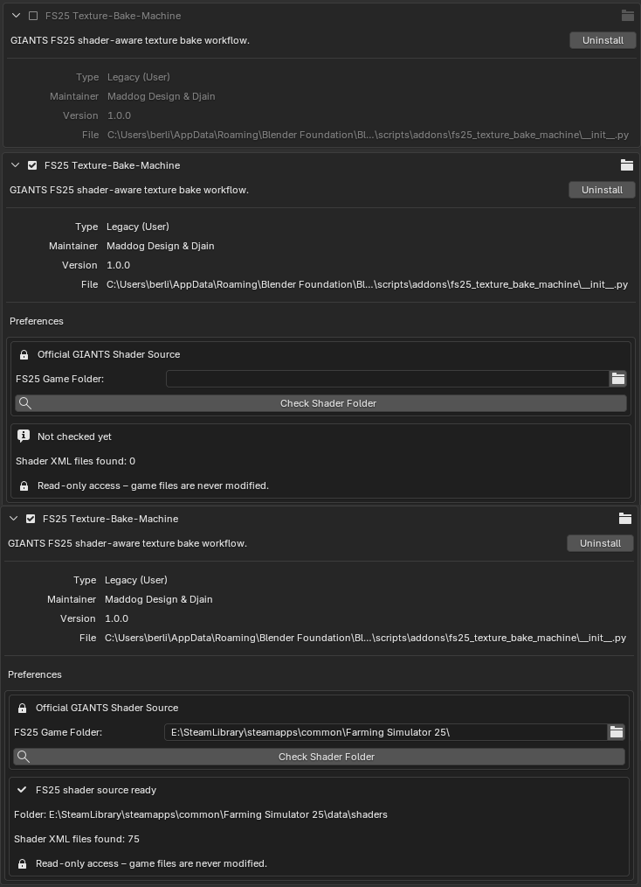
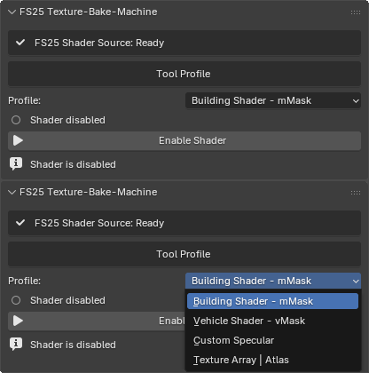
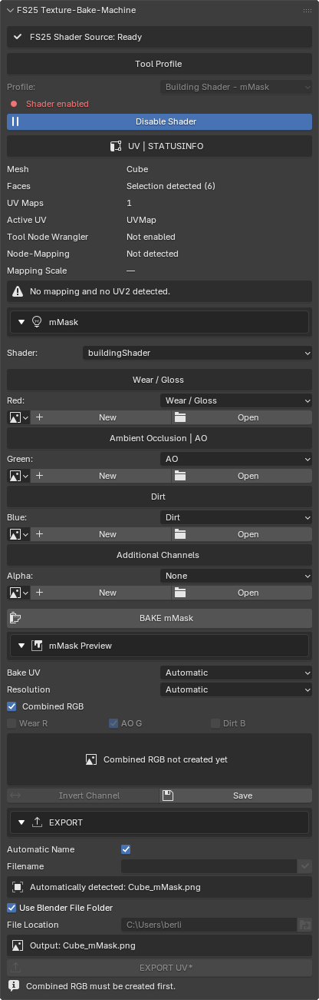
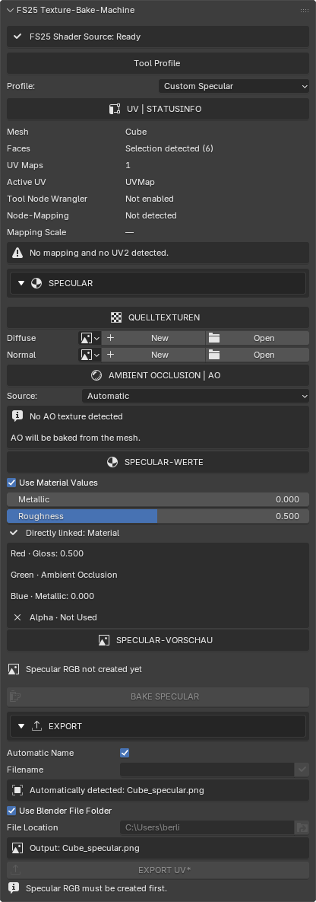
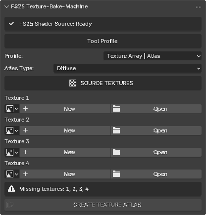

# FS25 Texture-Bake-Machine

**Version 1.0.0** · **Entwickler: Maddog Design & Djain**  
[English documentation](README.md)

Ein Blender-Add-on zum Vorbereiten und Packen von Texturen für Arbeitsabläufe mit GIANTS Farming Simulator 25. Wiederkehrende Kanalbelegungen und Texture-Atlas-Aufgaben werden in einem kompakten Werkzeug der Blender-Seitenleiste zusammengeführt.

Getestet mit Blender **4.0.2**, **4.5.9 LTS**, **5.1.2** und **5.2.1 LTS**.

## Installation und Shader-Quelle

Das Add-on in den Blender-Einstellungen installieren und aktivieren. Danach in den Add-on-Einstellungen den Farming-Simulator-25-Spielordner auswählen und **Check Shader Folder** ausführen. Die Suche greift ausschließlich lesend zu; Spieldateien werden niemals verändert.

## Werkzeugprofile

In der Seitenleiste der 3D-Ansicht den Reiter **FS25 Bake** öffnen und den gewünschten Arbeitsablauf auswählen:

- **Building Shader – mMask**
- **Vehicle Shader – vMask**
- **Custom Specular**
- **Texture Array | Atlas**

Nur die Profile mMask und vMask benötigen eine Shader-Aktivierung. Custom Specular und Texture Array | Atlas stehen direkt zur Verfügung.

## Building mMask und Vehicle vMask

mMask und vMask verwenden denselben kompakten Ablauf zur Kanalbelegung. Das passende Shaderprofil auswählen und die gemalten Graustufentexturen zuweisen:

| Kanal | Standardinhalt |
| --- | --- |
| Rot | Wear / Gloss |
| Grün | Ambient Occlusion / AO |
| Blau | Dirt |
| Alpha | Optionaler zusätzlicher Kanal |

Das Add-on prüft das aktive Mesh und die UV-Konfiguration, packt die ausgewählten Texturen, zeigt eine kombinierte Vorschau und exportiert das Ergebnis mit der zum Profil passenden Dateiendung (`_mMask.png` oder `_vMask.png`).

## Custom Specular

Custom Specular erzeugt eine gepackte RGB-Specular-Textur, ohne dass dafür ein GIANTS-Shader aktiviert werden muss. Diffuse- und Normal-Texturen können aus dem aktiven Material erkannt oder manuell ausgewählt werden. AO lässt sich als Textur zuweisen oder automatisch vom Mesh backen.

| Kanal | Ausgabe |
| --- | --- |
| Rot | Gloss (`1 − Roughness`) |
| Grün | Ambient Occlusion |
| Blau | Metallic |
| Alpha | Nicht verwendet |

Die Werte für Metallic und Roughness können direkt aus dem aktiven Principled BSDF übernommen oder manuell eingegeben werden.

## Texture Array | Atlas

Dieses Profil stapelt vier Quelltexturen vertikal zu einem PNG-Atlas. Textur 1 liegt oben und Textur 4 unten.

Alle vier Quelltexturen müssen:

- vorhanden sein;
- identische quadratische Abmessungen besitzen;
- eine der unterstützten Größen verwenden: 512, 1024, 2048 oder 4096 Pixel;
- dieselbe Bildtiefe besitzen.

Beispiel: Vier Texturen mit 1024 × 1024 Pixeln ergeben einen Atlas mit 1024 × 4096 Pixeln. Als Atlas-Typ stehen Diffuse, Normal und Specular zur Verfügung.

## Ausgabe und Status

- Während der Verarbeitung bleibt Blenders native Fortschrittsanzeige sichtbar.
- Automatische und frei gewählte Dateinamen werden unterstützt.
- Als Speicherort kann der aktuelle `.blend`-Ordner oder ein manuell gewählter Ordner dienen.
- Vorhandene Dateien werden erst nach einer Bestätigung überschrieben.
- Der Atlas wird als PNG exportiert und kann anschließend bei Bedarf in ein anderes Spieltexturformat umgewandelt werden.

## Lizenz

Copyright © 2026 Maddog Design & Djain.

Dieses Projekt ist unter der **GNU General Public License v3.0 oder später** (`GPL-3.0-or-later`) veröffentlicht. Einzelheiten stehen in der Datei [LICENSE](LICENSE).
