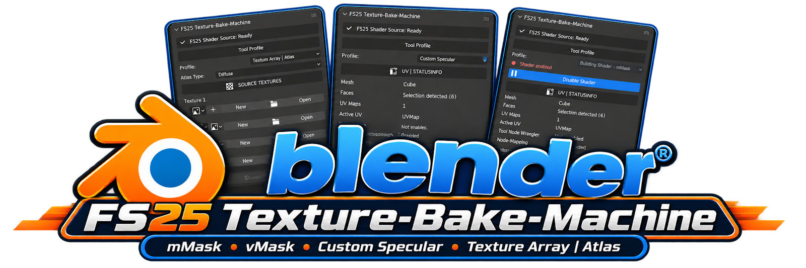

# FS25 Texture-Bake-Machine

**Version 1.0.1** · **Maintainers: Maddog Design & Djain**  
[Deutsche Dokumentation](README.de.md)

A Blender add-on for preparing and packing texture maps for GIANTS Farming Simulator 25 workflows. It combines recurring channel-packing and texture-atlas tasks in one compact Blender sidebar tool.

Tested with Blender **4.0.2**, **4.5.9 LTS**, **5.1.2**, and **5.2.1 LTS**.

## Update 1.0.1

- Newly created Wear, AO, and Dirt textures use the correct black RGBA values. The active material is renamed to **Wear-Mask**, **AO-Mask**, or **Dirt-Mask** as appropriate.
- The name, width, and height of a new channel texture can be set in the New dialog.
- The width, height, and color depth of the assigned channel texture are displayed directly in the add-on.
- Newly created or baked channel textures are activated automatically as the Texture Paint canvas and in the Image Editors of all existing workspaces.
- Selected mesh faces are assigned automatically to the active mask material; when no faces are selected, the full mesh is used.
- The Image Texture node is connected automatically to **Principled BSDF → Base Color**, and the material in use is shown in the add-on. An existing regular material is reused for the first mask channel. Additional mask channels receive their own slots, while an existing channel material is reused without duplication.
- Native AO baking and its essential settings are available directly in the add-on; a notice appears when Cycles is not active.
- Wear, AO, and Dirt images can be saved individually. An asterisk on **Save Image\*** indicates unsaved changes.
- AO bake settings open automatically when an AO texture is created or loaded.
- Selection fields and labels were aligned for a cleaner, consistent layout.
- The new **Material Bakes** section detects Diffuse and Normal sources on the active Principled BSDF and bakes them through the active bake UV. Existing node mapping, including its scale, is evaluated.
- Diffuse and Normal results are created as RGBA/32-bit images and can be saved separately. Normal results use Non-Color data.
- The mMask/vMask preview refreshes automatically. Single channels are shown in grayscale, multiple channels in RGB, and **Combined RGB** as the fully packed mask.
- Preview inversion leaves the source image untouched. Regardless of the inspection view, **Save** always writes the combined mMask or vMask.

## Installation and shader source

Install and enable the add-on in Blender's Preferences. In the add-on preferences, select the Farming Simulator 25 game folder and run **Check Shader Folder**. The scan uses read-only access; game files are never modified.

## Tool profiles

Open the **FS25 Bake Machine** tab in the 3D View sidebar and select the required workflow:

- **Building Shader – mMask**
- **Vehicle Shader – vMask**
- **Custom Specular**
- **Texture Array | Atlas**

Only the mMask and vMask profiles require shader activation. Custom Specular and Texture Array | Atlas are available directly.

## Building mMask and Vehicle vMask

The mMask and vMask profiles use the same compact channel-assignment workflow. Select the corresponding shader profile and assign the painted grayscale textures:

| Channel | Default content |
| --- | --- |
| Red | Wear / Gloss |
| Green | Ambient Occlusion / AO |
| Blue | Dirt |
| Alpha | Optional additional channel |

The add-on validates the active mesh and UV setup, packs the selected maps, and exports the result with the profile-specific filename suffix (`_mMask.png` or `_vMask.png`). An existing UV1 or UV2 can be used as the bake UV; existing UV data is never changed without the user's intent.

The preview responds immediately to its channel selection. A single channel is shown in grayscale, multiple active channels are shown together in their RGB colors, and **Combined RGB** displays the finished packed mask.

## Custom Specular

Custom Specular creates a packed RGB specular texture without requiring a GIANTS shader to be activated. Diffuse and Normal textures can be detected from the active material or selected manually. AO can be supplied as a texture or baked automatically from the mesh.

| Channel | Output |
| --- | --- |
| Red | Gloss (`1 − Roughness`) |
| Green | Ambient Occlusion |
| Blue | Metallic |
| Alpha | Not used |

Material Metallic and Roughness values can be read directly from the active Principled BSDF or entered manually.

## Material bakes and ambient occlusion

The shared **Material Bakes** section is available in the mMask, vMask, and Custom Specular profiles. It detects Diffuse and Normal sources on the active Principled BSDF and bakes them through the active bake UV into new RGBA/32-bit images. Existing node mapping, including its scale, is evaluated during the bake. Diffuse and Normal each provide their own **Save Image** action.

AO can be baked directly into the assigned AO image with Cycles. Bake Type, Target, Clear Image, Margin Type, and Margin Size are available in the AO section. The result is then reactivated as the AO material, Texture Paint target, and Image Editor image.

## Texture Array | Atlas

This profile vertically stacks four source textures into one PNG atlas. Texture 1 is placed at the top and Texture 4 at the bottom.

All four source textures must:

- be present;
- have identical square dimensions;
- use one of the supported sizes: 512, 1024, 2048, or 4096 pixels;
- use the same image depth.

Example: four 1024 × 1024 textures produce one 1024 × 4096 atlas. Diffuse, Normal, and Specular atlas types are available.

## Output and status

- Native Blender progress reporting remains visible during processing.
- Automatic or custom output filenames are supported.
- The current `.blend` folder or a manually selected folder can be used.
- Existing files are overwritten only after confirmation.
- Atlas output is exported as PNG for later conversion when another game texture format is required.

## License

Copyright © 2026 Maddog Design & Djain.

This project is released under the **GNU General Public License v3.0 or later** (`GPL-3.0-or-later`). See [LICENSE](LICENSE) for details.
